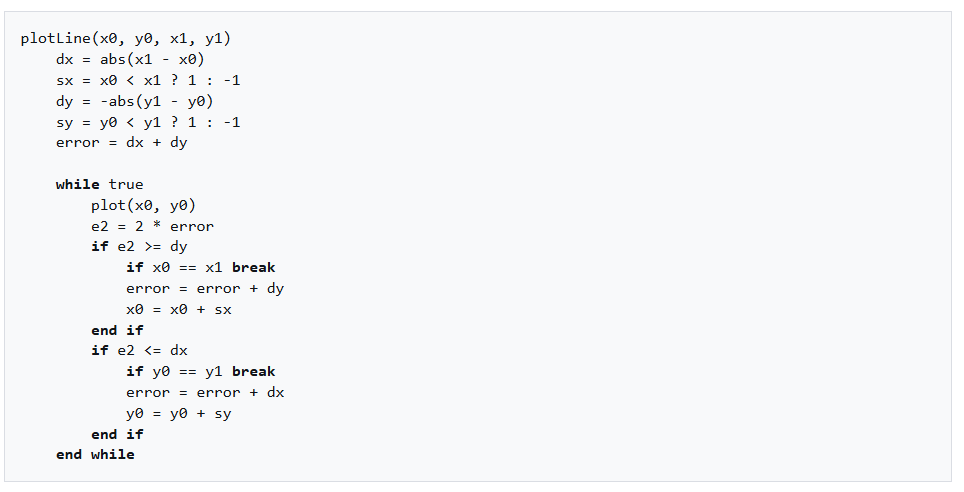
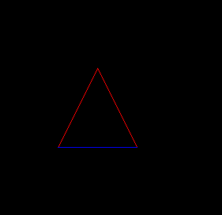

# Asteroids

## PART 0

I do think this project is a bad project that should not even be public. But anyway, I will do it as a kind of blogging practice and for future reference.

This game has the intent to look like an asteroid game where you have to destroy asteroids and not allow your rocket to be hit.
Your "rocket" here is just a triangle, and the asteroids will be a bunch of ellipses floating around in space.

The goal of this project is to practice the basics of C/C++ and to get some practice making things from "scratch." Here, as you can see in the code, I am not using any third-party engine or anything—I am writing it all by myself.
That means that everything drawn on the screen is being drawn pixel by pixel.

---

All that I should say is inspired on Handmade Hero, Casey Muratori's video serie https://guide.handmadehero.org/.

---

As an example, each line is being drawn using a version of Bresenham's algorithm:

https://en.wikipedia.org/wiki/Bresenham%27s_line_algorithm

Then, to draw the rocket (triangle), it’s just a matter of putting everything together in the right pattern.

Then, to figure out the movement, I started to use a bunch of 2D vector math. That wasn’t the difficult part, though—I actually had some fun doing that.

So far, the most difficult thing, I think, was figuring out how to draw a line and, after that, how to rotate the entire triangle using its own center as the origin (I needed a little help from Gemini to figure that out, to be honest).

So as you can see, I don't have a strong math background, I am learning as the need arises.

The next stuff now is to figure out how to have a unlimited space with the rocket on the center of the screen, and then add some asteroids to start to feel some challange.